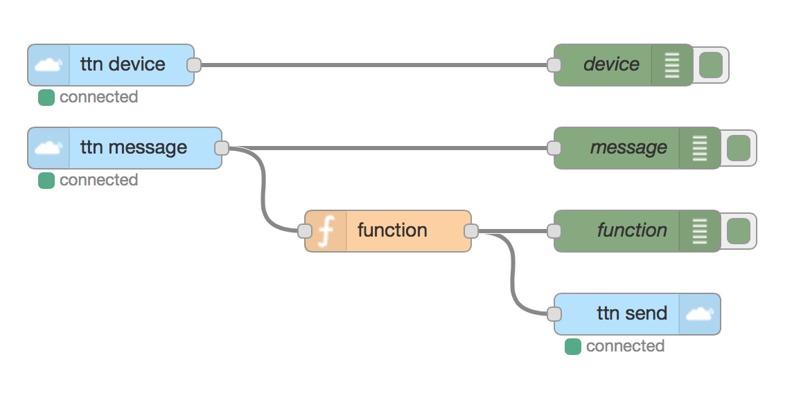

# The Things Network Node-RED Nodes
[](http://flows.nodered.org/node/node-red-contrib-ttn)

**⚠️ These nodes are not supported on Raspberry Pi ⚠️**

The Things Network Nodes for [Node-RED](http://nodered.org) to receive device events and messages as well as send messages to devices.

## Installation

```bash
cd $HOME/.node-red
npm install node-red-contrib-ttn
```

Make sure you have `git` installed.

See the [Node-RED Documentation / Adding Nodes](http://nodered.org/docs/getting-started/adding-nodes) for more options.

## Documentation

Go through the [quickstart](docs/quickstart.md) to get started.

## Examples

See [examples/quickstart.json](examples/quickstart.json).

[](examples/quickstart.json)

